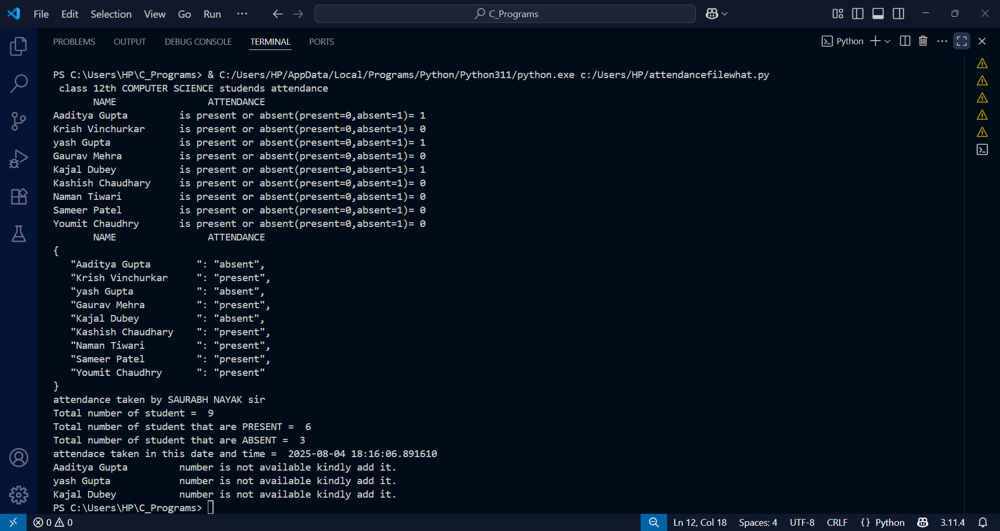
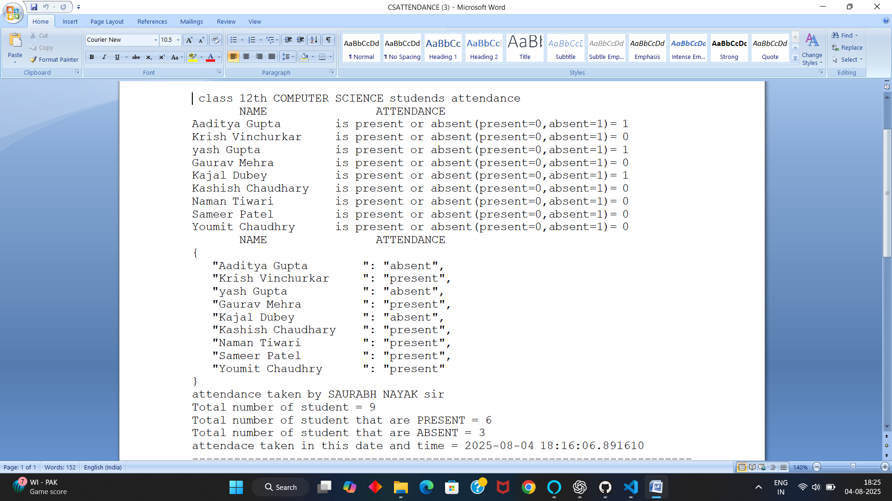
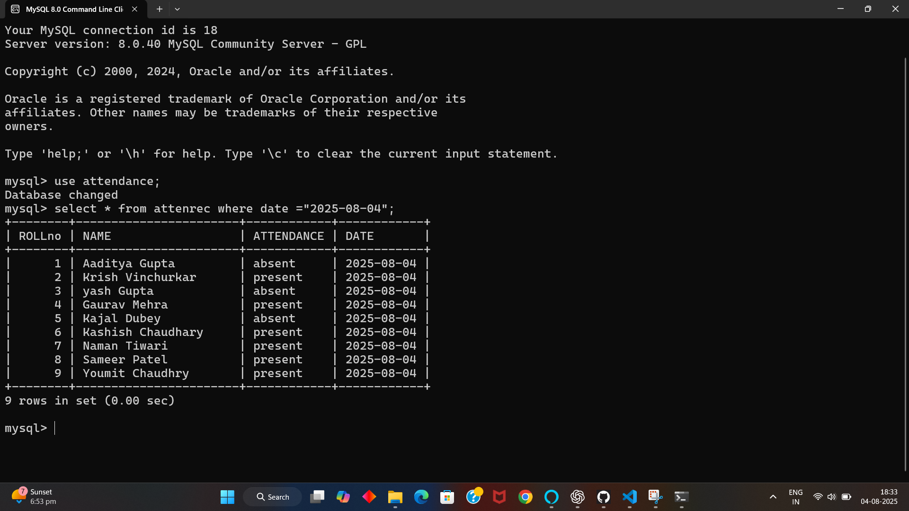

📊 Smart Attendance Program (Python)

A Python-based Smart Attendance Program that helps teachers or coordinators manage student attendance efficiently by:

:-Recording attendance (Present/Absent)

:-Saving logs in .txt files

:-Storing data in MySQL database

:-Sending automated WhatsApp notifications for absentees

:-Speaking out names of absent students

-----------------------------------------------------------------------------------------------------------------------

✅ Features
📝 Simple interface for marking attendance

💾 Saves records in a text file

🗄️ MySQL database integration

🕒 Automatic Date & Time stamps

📊 Shows summary of total, present & absent students

📲 Sends WhatsApp notifications via pywhatkit

🗣️ Speaks names of absent students (using pyttsx3)

🚫 Handles wrong inputs gracefully

---------------------------------------------------------------------------------------------

🛠️ Technologies Used

Technology     ( Purpose )

Python 3.x     ( Main programming )

.txt file     ( File Handling )

MySQL	    ( Data storage )

pywhatkit     ( WhatsApp automation )

pyttsx3	    ( Text-to-Speech (TTS) )

datetime & json     ( Logging & formatting )

--------------------------------------------------------------------------------------------

📁 Project Structure

📦 Smart-Attendance-Program

 ┣ 📄 attendance.py
 
 ┣ 📄 README.md
 
 ┣ 📄 LICENSE
 
 ┣ 📄 .gitignore
 
 ┗ 📁 images/
 
     ┣ 📄 github-banner.png
     
     ┣ 📄 python-terminal-demo.png
     
     ┣ 📄 txt-file-demo.png
     
     ┣ 📄 mysql-database-demo.png
     
     ┗ 📄 whatsapp-msg-demo.png
     

--------------------------------------------------------------------------------------------

💻 How to Use

🔹 1. Clone the Repository 

git clone https://github.com/your-username/Smart-Attendance-Program.git
cd Smart-Attendance-Program

🔹 2. Install Required Packages

pip install pywhatkit 

pip install mysql-connector-python 

pip install pyttsx3

🔹 3. Set Up MySQL Database

CREATE DATABASE attendance;

USE attendance;

CREATE TABLE AttenRec (
  ROLLno INT,
  NAME VARCHAR(100),
  ATTENDANCE VARCHAR(10),
  DATE DATE
);

🔹 4. Run the Program

python attendance.py

Make sure:

MySQL server is running.

WhatsApp Web is logged in (for pywhatkit to work).

-----------------------------------------------------------------------------------------

## 🖼️ Demo Screenshots

### ✅ Terminal Attendance Recording

### ✅ Attendance Log File

### ✅ MySQL Database Entry

### ✅ WhatsApp Notification Example

---------------------------------------------------------------------------------------

📄 License
This project is licensed under the MIT License.

🙌 Contributing
Contributions are welcome!
Fork the repo, make changes, and submit a Pull Request.

🌐 Connect with Me
LinkedIn := https://www.linkedin.com/in/aaditya-gupta-73a608378 
Gmail := aaditya31977@gmail.com

⭐ If you find this project useful, please give it a ⭐ star!

